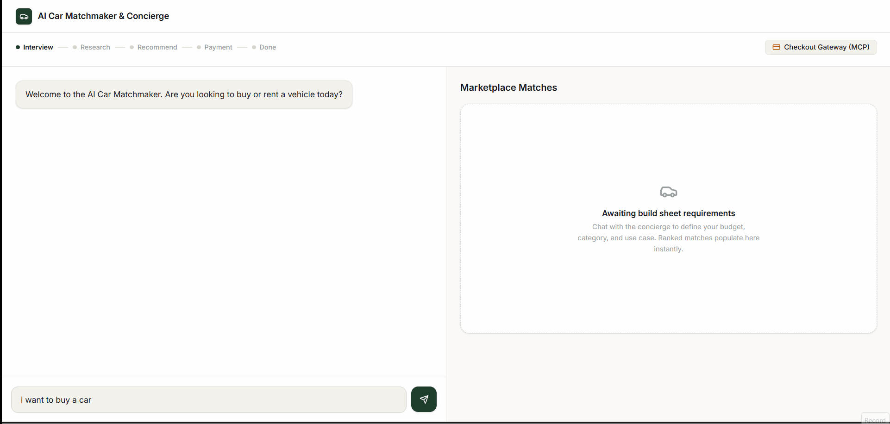
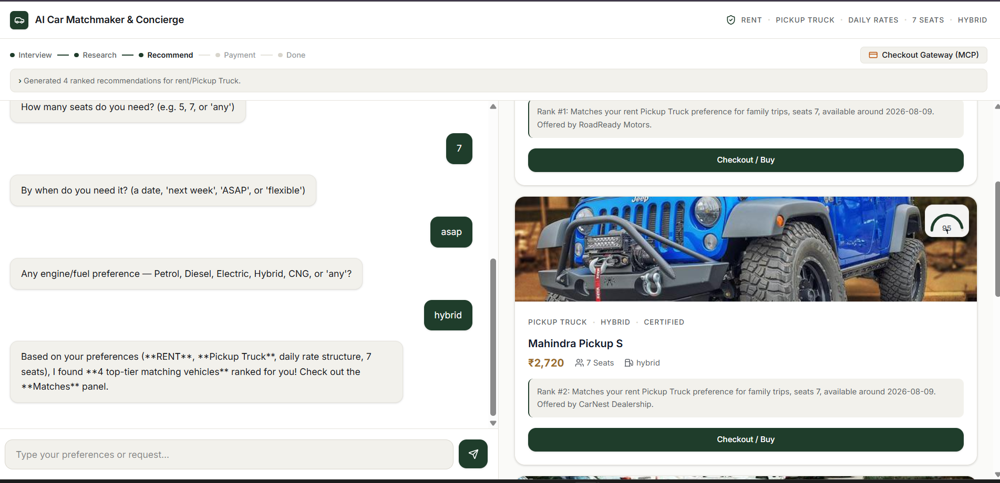
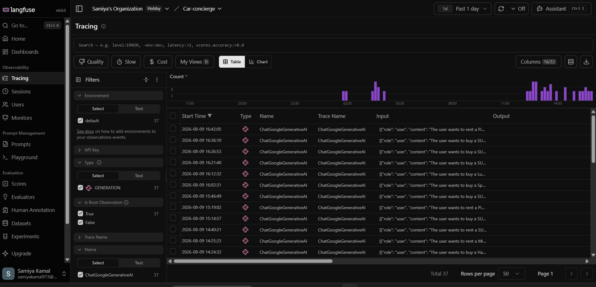

```markdown
<div align="center">

# 🚗 AI Car Concierge (Car Matchmaker)
### *Production-Grade Multi-Agent Automotive Concierge Powered by MCP, Langfuse, FastAPI, and Next.js*

[](https://www.docker.com/)
[](https://fastapi.tiangolo.com/)
[](https://nextjs.org/)
[](https://langfuse.com/)
[](#)

*An intelligent, context-aware virtual automotive consultant that translates complex user lifestyle needs, budget constraints, and personal preferences into precise vehicle recommendations in real time.*

<br>

<p align="center">
  
</p>
<sub>*Real-time agentic orchestration matching user prompts with curated vehicle recommendations.*</sub>

</div>

---

## 🌟 Overview

Finding the right vehicle is often an exhausting process fragmented across spec sheets, dealership listings, and conflicting reviews. **AI Car Concierge** transforms this experience into a natural, high-touch conversation.

By leveraging **Model Context Protocol (MCP)** tools and a multi-agent orchestrator, the platform deeply analyzes user requests, performs domain-specific retrieval, ranks matching vehicles, and delivers human-like recommendations backed by full LLM observability.

---

## 🖥️ User Interface

<div align="center">
  
  <br>
  <em>Modern, responsive Next.js conversational interface designed for seamless user interaction.</em>
</div>

---

## 📊 LLM Observability & Tracing (Langfuse)

To ensure enterprise-grade reliability, prompt safety, and latency monitoring, the backend is fully instrumented with **Langfuse**. 

<div align="center">
  
  <br>
  <em>Live Langfuse dashboard capturing real-time agent execution traces, token generation logs, and latency telemetry.</em>
</div>

* **Full Agent Tracing:** Complete visibility into every `ChatGoogleGenerativeAI` call, orchestrator step, and MCP server execution.
* **Performance Telemetry:** Granular tracking of execution times, token counts, and API response costs.
* **Evaluation & Debugging:** Instant inspection of agent decision paths and structured tool outputs.

---

## 🏗️ System Architecture

```text
  ┌─────────────────────────────────────────────────────────┐
  │                   Next.js Frontend                      │
  │                  (Port 3001 : 3000)                     │
  └───────────────────────────┬─────────────────────────────┘
                              │ HTTP / REST
                              ▼
  ┌─────────────────────────────────────────────────────────┐
  │                   FastAPI Backend                       │
  │                     (Port 8000)                         │
  ├───────────────────────────┬─────────────────────────────┤
  │   Agent Orchestrator      │    Langfuse Telemetry       │
  │   (Model Context Protocol)│    (Traces & Telemetry)     │
  └─────────────┬─────────────┴──────────────┬──────────────┘
                │                            │
                ▼                            ▼
      ┌──────────────────┐          ┌──────────────────┐
      │  MCP Servers &   │          │  Langfuse Cloud  │
      │  Google GenAI    │          │    Observability │
      └──────────────────┘          └──────────────────┘

```

---

## 🐳 Docker Deployment

The application is completely containerized, allowing the entire stack to be built and run with a single command.

### Environment Setup

Create a `.env` file inside the `backend/` directory:

```env
GOOGLE_API_KEY=your_google_api_key
LANGFUSE_PUBLIC_KEY=your_langfuse_public_key
LANGFUSE_SECRET_KEY=your_langfuse_secret_key
LANGFUSE_HOST=[https://cloud.langfuse.com](https://cloud.langfuse.com)

```

### Run with Docker Compose

From the root directory of the project, execute:

```bash
docker-compose up --build

```

### Services & Port Mappings

| Service | Container Port | Host Port | URL / Endpoint |
| --- | --- | --- | --- |
| **Frontend (Next.js)** | `3000` | `3001` | [http://localhost:3001](http://localhost:3001) |
| **Backend (FastAPI)** | `8000` | `8000` | [http://localhost:8000](http://localhost:8000) |
| **API Documentation** | `8000` | `8000` | [http://localhost:8000/docs](http://localhost:8000/docs) |

---

## 🛠️ Tech Stack

* **Frontend:** Next.js, React, Tailwind CSS
* **Backend:** Python, FastAPI, Uvicorn
* **AI & Multi-Agent:** Google GenAI / Gemini, Custom Model Context Protocol (MCP) Servers
* **Observability:** Langfuse Tracing & Telemetry
* **DevOps:** Docker, Docker Compose

---

## 👩‍💻 Developer

**Samiya Kamal**

*Artificial Intelligence Undergraduate @ Zakir Husain College of Engineering and Technology, AMU*

* **GitHub:** [Samiya973](https://www.google.com/search?q=https://github.com/Samiya973)
* **Repository:** [car-concierge](https://www.google.com/search?q=https://github.com/Samiya973/car-concierge)

```

```