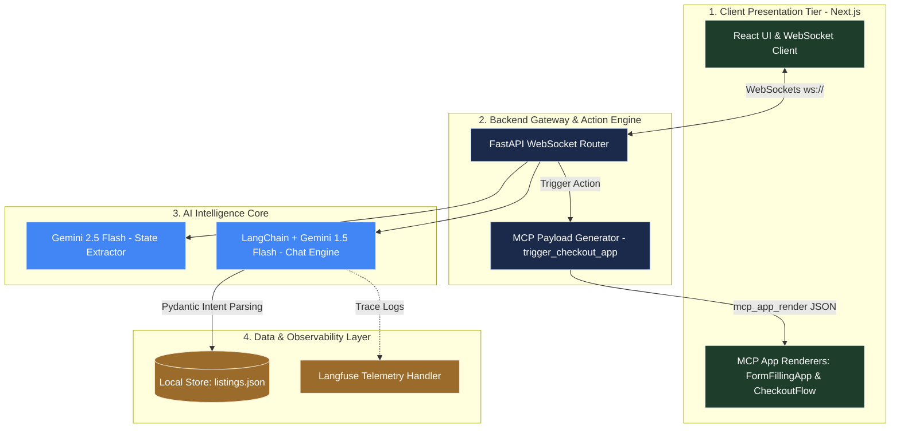

<div align="center">

# 🚗 AI Car Concierge
### Production-Grade Multi-Agent Automotive Concierge

**Built for the Amulate Summer Hackathon 2026 — AI Car Matchmaker Challenge**

[](https://www.docker.com/)
[](https://fastapi.tiangolo.com/)
[](https://nextjs.org/)
[](https://langfuse.com/)
[](#)
[](#)

*A multistep AI agent that interviews you, researches a live marketplace, and ranks — and*
*explains — its car recommendations, with booking and payment handled entirely in-chat via MCP Apps.*


</div>

<br>

## 📋 Table of Contents

- [Overview](#-overview)
- [Requirements Checklist](#-hackathon-requirements-checklist)
- [System Architecture](#️-system-architecture)
- [User Interface](#️-user-interface)
- [Observability](#-llm-observability--tracing-langfuse)
- [Tech Stack](#️-tech-stack)
- [Project Structure](#-project-structure)
- [Getting Started](#-getting-started)
- [API Reference](#-api-reference)
- [Developer](#-developer)

---

## 🌟 Overview

Finding the right vehicle usually means fighting through spec sheets, scattered listings,
and conflicting reviews across a dozen tabs. **AI Car Concierge** turns that into one
conversation.

A multistep agent interviews the user (intent, use case, category, budget, seats, target
date, fuel type), searches a mock marketplace of 130+ listings, ranks the results with a
transparent scoring model, and explains *why* each car made the cut — all while the agent's
live reasoning and stage progression render in the UI as it works. Booking and payment
happen without ever leaving the chat, via two dedicated MCP Apps.

**At a glance:**

- 🗣️ Conversational, slot-filling interview — no forms until you're ready to book
- 🔍 130+ mock listings across 11 categories × 10 brands, ranked by a transparent scoring model
- 🧠 Every recommendation ships with a plain-English explanation of why it matched
- 📊 Live agent-state strip — see the interview → research → recommend → payment pipeline as it happens
- 💳 In-chat MCP Apps for booking and mock payment — zero page navigation
- 📈 Full Langfuse tracing on every LLM call and orchestration step

---

## ✅ Hackathon Requirements Checklist

| Brief requirement | Status | Where |
|---|:---:|---|
| Conversational interview (use case, category, budget, buy/rent, target date) | ✅ | `agent/orchestrator.py` |
| Research + ranked, explained suggestions | ✅ | `agent/ranking.py` |
| MCP App — form-filling flow, rendered in-chat | ✅ | `agent/mcp_server.py` → `FormFillingApp` |
| MCP App — mock payment/checkout, rendered in-chat | ✅ | `agent/mcp_server.py` → `CheckoutFlow` |
| Mock marketplace ≥100 listings, ≥10 categories, ≥10 brands/category | ✅ | `data/listings.json` (130 listings, 11 categories) |
| Multistep agent memory across interview/research/recommendation | ✅ | `agent/state.py` (`AgentSession`) |
| Dynamic UI for interview state, search status, reasoning steps | ✅ | Agent-state strip in `page.tsx` |
| Spec-driven development artifacts | ✅ | `spec/` |
| Docker deployment | ✅ | `docker-compose.yml` |
| Bonus: OpenTelemetry tracing via Langfuse | ✅ | `llm.py` + Langfuse callback handler |

---

## 🏗️ System Architecture



**Flow, in words:** the browser holds a persistent WebSocket to FastAPI. Every user message
runs through the LangChain + Gemini chat engine, which extracts structured preferences into
`AgentSession` (backed by `listings.json`) and streams the reply back token by token, with
every step traced to Langfuse. Once the user picks a car, the backend emits an
`mcp_app_render` payload that the frontend recognizes and mounts as a live MCP App — first
`FormFillingApp` to collect booking details, then `CheckoutFlow` for the mocked payment —
both fully in-chat, no redirects.

---

## 🖥️ User Interface

<div align="center">
  
  <br>
  <em>Live agent-state strip, conversational interview, and ranked match catalogue — all in one view.</em>
</div>

---

## 📊 LLM Observability & Tracing (Langfuse)

Every `ChatGoogleGenerativeAI` call, orchestrator step, and MCP action is traced end to end.

<div align="center">
  
  <br>
  <em>Live Langfuse dashboard — agent execution traces, token usage, and latency telemetry.</em>
</div>

- **Full agent tracing** — every LLM call, orchestrator step, and MCP action captured
- **Performance telemetry** — execution time, token counts, and cost per turn
- **Debugging** — inspect the agent's decision path and structured tool outputs turn by turn

---

## 🛠️ Tech Stack

| Layer | Technology |
|---|---|
| **Frontend** | Next.js, React, Tailwind CSS |
| **Backend** | Python, FastAPI, Uvicorn, WebSockets |
| **AI / Orchestration** | Google Gemini (2.5 Flash + 1.5 Flash), LangChain, custom MCP servers |
| **Observability** | Langfuse tracing & telemetry |
| **DevOps** | Docker, Docker Compose |

---

## 📁 Project Structure

```
ai-car-matchmaker/
├── backend/
│   ├── app/
│   │   ├── agent/
│   │   │   ├── llm.py            # Gemini chat engine + Langfuse handler
│   │   │   ├── mcp_server.py     # In-chat MCP Apps: FormFillingApp, CheckoutFlow
│   │   │   ├── orchestrator.py   # Multistep interview -> research -> recommend
│   │   │   ├── ranking.py        # Scoring + explanation engine
│   │   │   └── state.py          # AgentSession / Stage / preference models
│   │   ├── data/
│   │   │   └── listings.json     # 130 mock listings, 11 categories x 10 brands
│   │   ├── mcp_servers/
│   │   │   └── server.py         # Marketplace tool server (search_listings, etc.)
│   │   └── main.py               # FastAPI app + WebSocket router
│   ├── spec/                     # Spec-driven development artifacts
│   ├── Dockerfile
│   └── requirements.txt
├── frontend/
│   ├── components/
│   │   └── CheckoutApp.jsx       # MCP App renderer for checkout
│   ├── src/
│   │   ├── app/page.tsx          # Chat UI + agent-state strip + match catalogue
│   │   ├── lib/api.ts
│   │   └── types/index.ts
│   └── Dockerfile
└── docker-compose.yml
```

---

## 🚀 Getting Started

### Environment Setup

Create a `.env` file inside `backend/`:

```env
GOOGLE_API_KEY=your_google_api_key
LANGFUSE_PUBLIC_KEY=your_langfuse_public_key
LANGFUSE_SECRET_KEY=your_langfuse_secret_key
LANGFUSE_HOST=https://cloud.langfuse.com
```

### Run with Docker Compose

```bash
docker-compose up --build
```

### Services & Ports

| Service | Container Port | Host Port | URL |
|---|:---:|:---:|---|
| **Frontend (Next.js)** | 3000 | 3001 | [http://localhost:3001](http://localhost:3001) |
| **Backend (FastAPI)** | 8000 | 8000 | [http://localhost:8000](http://localhost:8000) |
| **API Docs (Swagger)** | 8000 | 8000 | [http://localhost:8000/docs](http://localhost:8000/docs) |

---

## 🔌 API Reference

| Endpoint | Method | Purpose |
|---|---|---|
| `/api/chat/ws/{session_id}` | WS | Streaming conversational interface + live agent state |
| `/api/checkout/confirm` | POST | Mock payment confirmation (called by the CheckoutFlow MCP App) |
| `/api/book` | POST | Finalizes a booking against a session |

---

## 👩‍💻 Developer

**Samiya Kamal**
*Artificial Intelligence Undergraduate — Zakir Husain College of Engineering and Technology, AMU*

[](https://github.com/Samiya973)
[](https://github.com/Samiya973/car-concierge)